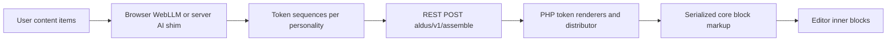

# Aldus architecture

One-page overview of how content becomes blocks, for reviewers and contributors.

## Data flow



1. **Content** — Structured items (headline, paragraph, image, …) live in the Aldus block’s React state (and optionally post meta).
2. **LLM** — For each active personality, the in-browser model (or WP AI shim) proposes a **token sequence** (layout recipe) from a closed vocabulary.
3. **REST** — The editor sends items + tokens + personality to **`POST /wp-json/aldus/v1/assemble`** (and related routes for config, health, telemetry, AI proxy).
4. **PHP** — `api-assemble.php` validates tokens, runs `aldus_render_block_token()` via `render-router.php` and per-block renderers, using `Aldus_Content_Distributor` to map content to blocks.
5. **Blocks** — Serialized **core** block HTML is returned; the editor parses it and inserts **inner blocks** under the Aldus wrapper.

The assembly stack (renderers, distributor, `api-assemble.php`) loads on **`rest_api_init`** so ordinary front-end page views that never hit the REST API avoid that parse cost.

## WordPress.org plugin directory screenshots

Capture these six assets for the listing (not committed here; add under `.wordpress-org/` or your release bundle):

1. Results grid — layout cards after generation.
2. Content entry — building screen with content items.
3. Single expanded layout — modal or focused card with preview.
4. Mixing screen — section mix UI.
5. Pack preview — themed pack selected, preview results.
6. Before/after compare — compare modal vs current page content.

## Internationalization

After updating translatable strings, refresh the POT and JSON used by the block script:

```bash
wp i18n make-pot . languages/aldus.pot --domain=aldus
wp i18n make-json languages --no-purge
```

The repository ships `languages/aldus.pot` only until locale files exist. `make-json` emits `*.json` beside each `*.po` file; with no `.po` files yet, it creates zero JSON files (expected).

## Theme integration (follow-ups)

These are **not** all implemented end-to-end; they are the intended alignment targets with `theme.json` and global styles:

| Area | Goal |
|------|------|
| **Spacing** | Map spacer output to `settings.spacing.spacingSizes` / rhythm tokens. |
| **Custom CSS** | Respect `settings.custom` where themes expose design tokens. |
| **CSS variables** | Prefer `var(--wp--preset--color--slug)` (and similar) over hard-coded hex where the cascade should win. |
| **Preset classes** | Where appropriate, use `wp_style_engine_get_styles()` with `convert_vars_to_classnames` so output uses `.has-*-color` classes. |
| **Fluid typography** | Honor `typography.fluid` — avoid static `px` when the theme expects `clamp()`. |
| **Border radius (WP 6.9+)** | Align with `border.radiusSizes`. |
| **Aspect ratios (WP 6.6+)** | Align Cover/Image with `dimensions.aspectRatios`. |

Existing code in `includes/theme.php` (palette, font sizes, spacing injection, `aldus_inject_theme_json`) is the foundation; the rows above extend coverage per renderer.
